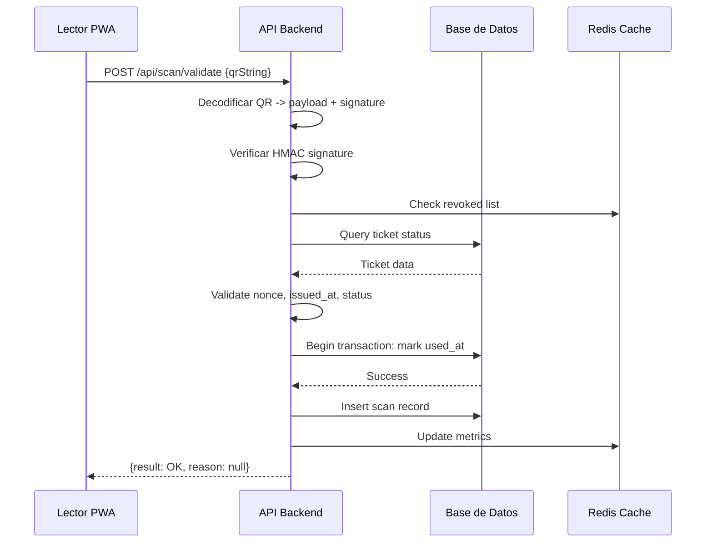
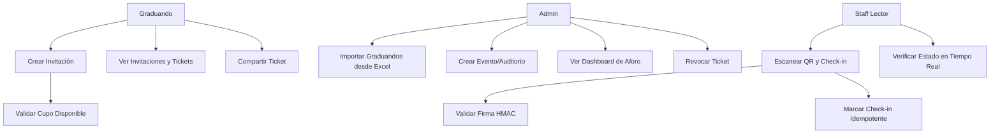

# Arquitectura del Sistema Anti-Falsificación de Entradas

## Arquitectura Limpia (Clean Architecture)

El sistema sigue los principios de Clean Architecture propuestos por Robert C. Martin, organizando el código en capas concéntricas donde las dependencias apuntan hacia adentro. Esto protege las reglas de negocio y facilita el testing, mantenimiento y evolución.

### Capas

1. **Entidades (Entities)**: Objetos de negocio puros sin dependencias externas.
   - `Ticket`: Representa un ticket con QR, firma y estado.
   - `Invitation`: Invitación creada por graduando.
   - `Graduate`: Graduando con cupos.
   - `Event`: Evento/auditorio.
   - `Scan`: Registro de escaneo.

2. **Casos de Uso (Use Cases)**: Lógica de aplicación, orquestan entidades y repositorios.
   - `CreateInvitationUseCase`: Crear invitación dentro del cupo.
   - `ScanTicketUseCase`: Validar QR y marcar check-in.
   - `ImportGraduatesUseCase`: Procesar Excel y crear graduandos.
   - `GenerateQrUseCase`: Generar QR con firma HMAC.

3. **Interfaces (Interfaces/Ports)**: Contratos para acceso a datos y servicios externos.
   - `TicketRepositoryInterface`: Persistencia de tickets.
   - `SignatureServiceInterface`: Firma y verificación HMAC.
   - `MailServiceInterface`: Envío de correos.
   - `QrGeneratorInterface`: Generación de QR.

4. **Infraestructura (Infrastructure/Adapters)**: Implementaciones concretas de interfaces.
   - `EloquentTicketRepository`: Usando Laravel Eloquent.
   - `HmacSignatureService`: Firma con HMAC-SHA256.
   - `LaravelMailService`: Usando Mailables.
   - `QrCodeGenerator`: Librería como chillerlan/php-qrcode.

### Regla de Dependencia

- Las flechas de dependencia apuntan hacia adentro: Infraestructura → Interfaces → Casos de Uso → Entidades.
- No hay dependencias de entidades hacia frameworks.
- Inyección de dependencias para invertir control.

### Puertos y Adaptadores

- **Puertos**: Interfaces que definen contratos (e.g., `TicketRepositoryInterface`).
- **Adaptadores**: Implementaciones concretas (e.g., `DatabaseTicketRepository`).
- Facilita testing con mocks y cambio de tecnologías (e.g., de MySQL a PostgreSQL).

### Protección de Reglas de Negocio

- Invariantes protegidas en entidades (e.g., cupo no negativo, ticket único uso).
- Validaciones en casos de uso (e.g., verificar firma antes de check-in).
- Transacciones en servicios para consistencia (e.g., marcar usado en check-in).

### Patrones Aplicados

- **Factory**: Para crear servicios de firma (e.g., `SignatureServiceFactory`).
- **Strategy**: Para validadores de QR (e.g., `QrValidatorStrategy`).
- **Repository**: Abstracción de persistencia.
- **Observer**: Para logs de auditoría en cambios de estado.
- **CQRS**: Opcional para lecturas de dashboard (separar comandos de queries).

### Beneficios

- **Mantenibilidad**: Cambios en UI o DB no afectan negocio.
- **Testabilidad**: Casos de uso testeables sin dependencias externas.
- **Extensibilidad**: Nuevas features (e.g., notificaciones push) agregan adaptadores.
- **Separación de Concerns**: Cada capa tiene responsabilidad única.

## Vista Lógica (Diagrama de Clases)

Los diagramas UML completos se encuentran en el archivo `docs/diagrams.md` que incluye:

- **Diagrama de Clases Completo**: Muestra todas las entidades, casos de uso, interfaces y adaptadores con sus relaciones y métodos.
- **Diagrama de Secuencia**: Detalla el flujo completo del escaneo de QR con validaciones y manejo de errores.
- **Diagrama de Despliegue**: Arquitectura de infraestructura con balanceo de carga, cache y base de datos.

### Resumen de Componentes Arquitectónicos

#### Entidades (Entities)
- **Ticket**: Representa un ticket con QR, firma HMAC y estado de uso.
- **Invitation**: Invitación creada por graduando con estado.
- **Graduate**: Graduando con cupos limitados para invitaciones.
- **Event**: Evento con fecha y estado.
- **Auditorium**: Auditorio con capacidad y ocupación actual.

#### Casos de Uso (Use Cases)
- **CreateInvitationUseCase**: Crea invitación validando cupos y generando QR.
- **ImportGraduatesUseCase**: Importa graduandos desde Excel con validaciones.
- **ScanTicketUseCase**: Valida QR y marca check-in con transacciones.

#### Interfaces (Ports)
- **Repository Interfaces**: Abstracción de persistencia para cada entidad.
- **SignatureServiceInterface**: Firma y verificación HMAC.
- **MailServiceInterface**: Envío de correos.
- **QrGeneratorInterface**: Generación de códigos QR.

#### Adaptadores (Adapters)
- **Eloquent Repositories**: Implementaciones usando Laravel Eloquent.
- **HmacSignatureService**: Servicio de firma con rotación de claves.
- **LaravelMailService**: Envío de correos usando Mailables.
- **QrCodeGenerator**: Generación de QR usando chillerlan/php-qrcode.

## Vista de Desarrollo (Estructura de Repositorios)

Monorepo con arquitectura completa implementada:

```
calidad/
├── backend/ (Laravel - Clean Architecture)
│   ├── app/
│   │   ├── Entities/ ✅
│   │   │   ├── Graduate.php
│   │   │   ├── Invitation.php
│   │   │   ├── Ticket.php
│   │   │   ├── Event.php
│   │   │   └── Auditorium.php
│   │   ├── UseCases/ ✅
│   │   │   ├── CreateInvitationUseCase.php
│   │   │   ├── ImportGraduatesUseCase.php
│   │   │   └── ScanTicketUseCase.php
│   │   ├── Interfaces/ ✅ (Ports)
│   │   │   ├── GraduateRepositoryInterface.php
│   │   │   ├── InvitationRepositoryInterface.php
│   │   │   ├── TicketRepositoryInterface.php
│   │   │   ├── EventRepositoryInterface.php
│   │   │   ├── AuditoriumRepositoryInterface.php
│   │   │   ├── SignatureServiceInterface.php
│   │   │   ├── MailServiceInterface.php
│   │   │   └── QrGeneratorInterface.php
│   │   ├── Infrastructure/ ✅ (Adapters)
│   │   │   └── Repositories/
│   │   │       ├── EloquentGraduateRepository.php
│   │   │       ├── EloquentInvitationRepository.php
│   │   │       ├── EloquentTicketRepository.php
│   │   │       ├── EloquentEventRepository.php
│   │   │       └── EloquentAuditoriumRepository.php
│   │   ├── Policies/ ✅
│   │   │   ├── GraduatePolicy.php
│   │   │   ├── TicketPolicy.php
│   │   │   └── EventPolicy.php
│   │   ├── Services/ ✅
│   │   │   ├── HmacSignatureService.php
│   │   │   ├── LaravelMailService.php
│   │   │   ├── QrCodeGenerator.php
│   │   │   └── ScanResult.php
│   │   └── Http/Controllers/
│   │       ├── Controller.php
│   │       └── ScanController.php
│   ├── database/migrations/ ✅
│   ├── tests/
│   └── composer.json
├── frontend/ (React + Vite)
│   ├── src/
│   ├── public/
│   ├── tests/
│   └── package.json
├── infra/
│   ├── docker-compose.yml
│   ├── Dockerfile
│   └── .env.example
├── docs/ ✅
│   ├── arquitectura.md
│   ├── diagrams.md (Diagramas UML)
│   ├── casos_uso.md
│   ├── estimacion_pf.md
│   └── presentacion.md
├── .github/workflows/
│   └── ci.yml
└── README.md
```

### Políticas de Autorización

Implementadas usando Laravel Policies para control de acceso basado en roles:

- **ADMIN**: Acceso completo a todas las operaciones
- **STAFF**: Puede escanear tickets y ver dashboards
- **GRADUANDO**: Puede crear invitaciones y ver sus tickets

### Reglas de Negocio Protegidas

1. **Entidades**: Invariantes protegidas (cupos no negativos, ticket único uso)
2. **Casos de Uso**: Validaciones de negocio y transacciones
3. **Transacciones**: Check-in atómico con bloqueo optimista
4. **Firma HMAC**: Verificación de integridad con rotación de claves

## Vista de Procesos (Diagrama de Secuencia: Escanear QR y Check-in)



## Vista Física (Despliegue)

```mermaid
graph TD
    A[Usuario Lector PWA] --> B[CDN/CloudFront]
    B --> C[API Gateway/Load Balancer]
    C --> D[App Servers (Laravel)]
    D --> E[Redis Cache]
    D --> F[Database (MySQL/PostgreSQL)]
    D --> G[Queue Worker (Redis)]
    G --> H[Mail Service (SMTP)]
    I[Admin Dashboard] --> C
    J[Graduate Portal] --> C
```

## Escenarios (Caso: Ingreso Masivo 10:00 AM con Duplicados)

- **Contexto**: 500 personas intentando ingresar simultáneamente, algunos con QR duplicados.
- **Flujo**:
  1. Lector escanea QR válidos: validación <150ms, check-in OK.
  2. Duplicados: rechazo inmediato con reason "DUPLICATE".
  3. Rate limiting: bloqueo temporal por dispositivo si >10 req/min.
  4. Colas: escaneos offline sincronizan en background.
  5. Métricas: dashboard actualiza en tiempo real (entradas/min).
- **Mitigación**: Caché local en PWA, idempotencia por nonce, transacciones optimistas.

## Diagrama de Casos de Uso 2.0



### Ejemplo Detallado: CU-01 Escanear QR e Ingresar

- **Necesidad**: Validar ticket QR y registrar ingreso único.
- **Pasos**:
  1. Staff escanea QR con dispositivo.
  2. Sistema decodifica QR a payload (eventId, ticketId, nonce, issuedAt).
  3. Verifica firma HMAC con clave actual/rotada.
  4. Consulta estado del ticket (no usado, no revocado).
  5. Valida vigencia (issuedAt < now < expiry).
  6. Marca check-in con transacción (set used_at, insert scan).
  7. Devuelve resultado OK o error con reason.
- **Reglas**:
  - Ticket 1-uso: estado cambia a USADO en primer check-in.
  - Evento vigente: fecha actual dentro del rango del evento.
  - Auditorio con capacidad: occupancy < capacity.
- **Excepciones**:
  - QR inválido: firma no verifica.
  - Duplicado: ticket ya usado.
  - Revocado: admin revocó.
  - Evento cerrado: fecha pasada.
- **Datos**: ticketId, eventId, scanned_at, device_id, result.