# Arquitectura 4+1 - Sistema Anti-Falsificación de Entradas

## Vista Lógica (Logical View)

### Diagrama de Clases Completo

```mermaid
classDiagram
    %% Entidades del Dominio
    class Ticket {
        +int id
        +int invitationId
        +array qrPayload
        +string qrSignature
        +string nonce
        +Carbon issuedAt
        +Carbon? usedAt
        +Carbon? revokedAt
        +isUsed(): bool
        +isRevoked(): bool
        +isExpired(): bool
        +canBeUsed(): bool
    }

    class Invitation {
        +int id
        +int graduateId
        +int eventId
        +string status
        +Carbon createdAt
        +isCreated(): bool
        +isSent(): bool
        +isRevoked(): bool
    }

    class Graduate {
        +int id
        +int userId
        +int cuposPermitidos
        +int cuposUsados
        +hasAvailableSlots(): bool
        +getRemainingSlots(): int
        +canCreateInvitation(): bool
    }

    class Event {
        +int id
        +string name
        +Carbon date
        +string status
        +isActive(): bool
        +isUpcoming(): bool
        +isPast(): bool
    }

    class Auditorium {
        +int id
        +int eventId
        +string name
        +int capacity
        +int currentOccupancy
        +hasAvailableCapacity(): bool
        +getAvailableCapacity(): int
        +canAccommodate(int): bool
    }

    class Scan {
        +int id
        +int ticketId
        +string deviceId
        +Carbon scannedAt
        +string result
        +bool isOfflineRetry
    }

    %% Casos de Uso
    class CreateInvitationUseCase {
        -GraduateRepositoryInterface graduateRepository
        -InvitationRepositoryInterface invitationRepository
        -EventRepositoryInterface eventRepository
        -TicketRepositoryInterface ticketRepository
        -SignatureServiceInterface signatureService
        -QrGeneratorInterface qrGenerator
        +execute(int, int): Invitation
    }

    class ImportGraduatesUseCase {
        -GraduateRepositoryInterface graduateRepository
        +execute(Collection): array
    }

    class ScanTicketUseCase {
        -TicketRepositoryInterface ticketRepository
        -SignatureServiceInterface signatureService
        +execute(string): ScanResult
    }

    %% Interfaces (Puertos)
    class TicketRepositoryInterface {
        <<interface>>
        +findById(int): Ticket?
        +findByNonce(string): Ticket?
        +save(Ticket): Ticket
        +markAsUsed(int): Ticket?
        +revoke(int): bool
        +getByInvitationId(int): array
    }

    class GraduateRepositoryInterface {
        <<interface>>
        +findById(int): Graduate?
        +findByUserId(int): Graduate?
        +save(Graduate): Graduate
        +incrementUsedSlots(int): Graduate?
        +decrementUsedSlots(int): Graduate?
        +getAll(): array
    }

    class InvitationRepositoryInterface {
        <<interface>>
        +findById(int): Invitation?
        +save(Invitation): Invitation
        +findByGraduateId(int): array
        +findByEventId(int): array
        +updateStatus(int, string): bool
    }

    class EventRepositoryInterface {
        <<interface>>
        +findById(int): Event?
        +save(Event): Event
        +getActiveEvents(): array
        +getUpcomingEvents(): array
        +updateStatus(int, string): bool
    }

    class AuditoriumRepositoryInterface {
        <<interface>>
        +findById(int): Auditorium?
        +findByEventId(int): array
        +save(Auditorium): Auditorium
        +updateOccupancy(int, int): bool
        +incrementOccupancy(int): bool
    }

    class SignatureServiceInterface {
        <<interface>>
        +sign(array): string
        +verify(array, string): bool
        +rotateKey(): void
    }

    class MailServiceInterface {
        <<interface>>
        +sendInvitationEmail(string, array): bool
        +sendTicketEmail(string, array): bool
    }

    class QrGeneratorInterface {
        <<interface>>
        +generate(string): string
        +generateWithLogo(string, string?): string
    }

    %% Adaptadores (Implementaciones)
    class EloquentTicketRepository {
        +findById(int): Ticket?
        +findByNonce(string): Ticket?
        +save(Ticket): Ticket
        +markAsUsed(int): Ticket?
        +revoke(int): bool
        +getByInvitationId(int): array
    }

    class EloquentGraduateRepository {
        +findById(int): Graduate?
        +findByUserId(int): Graduate?
        +save(Graduate): Graduate
        +incrementUsedSlots(int): Graduate?
        +decrementUsedSlots(int): Graduate?
        +getAll(): array
    }

    class EloquentInvitationRepository {
        +findById(int): Invitation?
        +save(Invitation): Invitation
        +findByGraduateId(int): array
        +findByEventId(int): array
        +updateStatus(int, string): bool
    }

    class EloquentEventRepository {
        +findById(int): Event?
        +save(Event): Event
        +getActiveEvents(): array
        +getUpcomingEvents(): array
        +updateStatus(int, string): bool
    }

    class EloquentAuditoriumRepository {
        +findById(int): Auditorium?
        +findByEventId(int): array
        +save(Auditorium): Auditorium
        +updateOccupancy(int, int): bool
        +incrementOccupancy(int): bool
    }

    class HmacSignatureService {
        +sign(array): string
        +verify(array, string): bool
        +rotateKey(): void
    }

    class LaravelMailService {
        +sendInvitationEmail(string, array): bool
        +sendTicketEmail(string, array): bool
    }

    class QrCodeGenerator {
        +generate(string): string
        +generateWithLogo(string, string?): string
    }

    %% Servicios de Aplicación
    class ScanResult {
        +string status
        +string? reason
        +array data
        +toArray(): array
    }

    %% Relaciones
    Ticket --> Invitation
    Invitation --> Graduate
    Invitation --> Event
    Event --> Auditorium
    Scan --> Ticket

    CreateInvitationUseCase --> GraduateRepositoryInterface
    CreateInvitationUseCase --> InvitationRepositoryInterface
    CreateInvitationUseCase --> EventRepositoryInterface
    CreateInvitationUseCase --> TicketRepositoryInterface
    CreateInvitationUseCase --> SignatureServiceInterface
    CreateInvitationUseCase --> QrGeneratorInterface

    ImportGraduatesUseCase --> GraduateRepositoryInterface
    ScanTicketUseCase --> TicketRepositoryInterface
    ScanTicketUseCase --> SignatureServiceInterface

    EloquentTicketRepository ..|> TicketRepositoryInterface
    EloquentGraduateRepository ..|> GraduateRepositoryInterface
    EloquentInvitationRepository ..|> InvitationRepositoryInterface
    EloquentEventRepository ..|> EloquentEventRepository
    EloquentAuditoriumRepository ..|> AuditoriumRepositoryInterface
    HmacSignatureService ..|> SignatureServiceInterface
    LaravelMailService ..|> MailServiceInterface
    QrCodeGenerator ..|> QrGeneratorInterface
```

## Vista de Desarrollo (Development View)

### Estructura de Paquetes

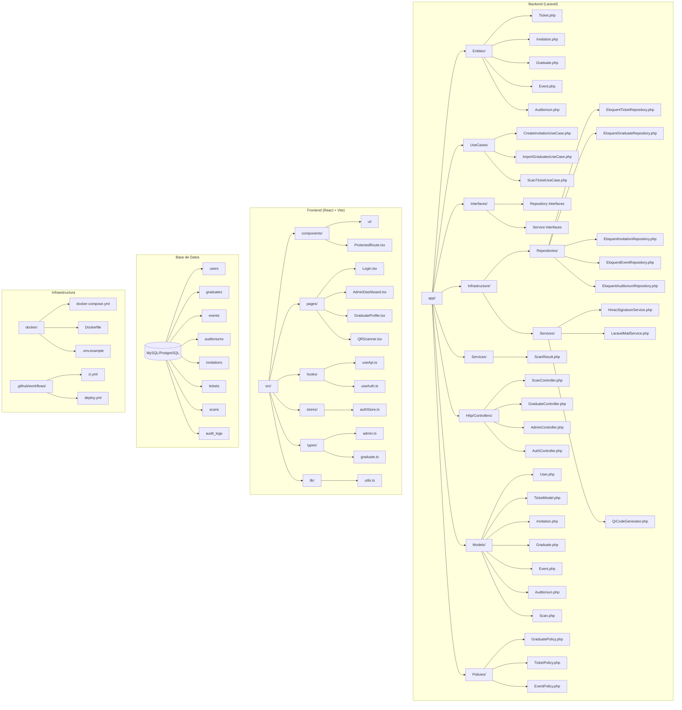

## Vista de Procesos (Process View)

### Diagrama de Secuencia - Escaneo QR Completo

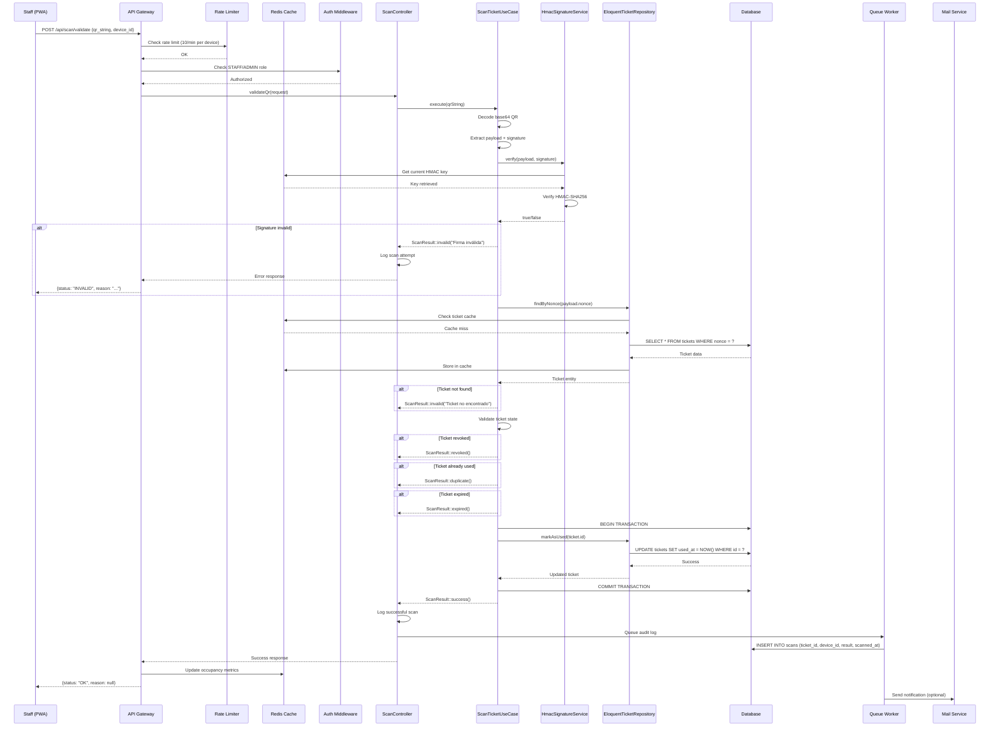

### Diagrama de Secuencia - Creación de Invitación

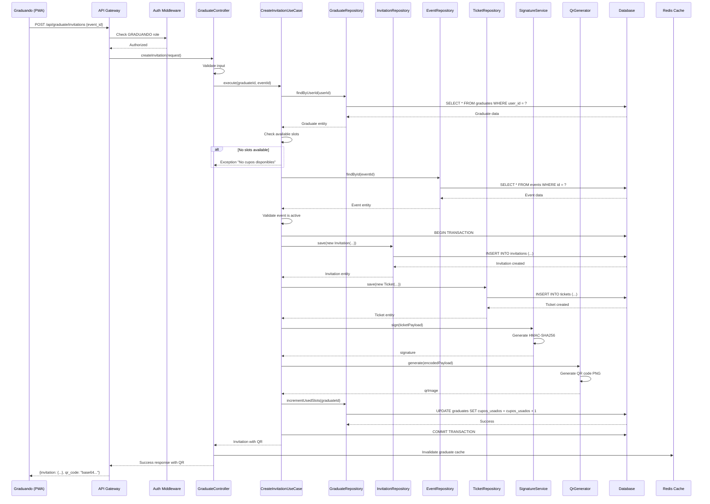

## Vista Física (Physical View)

### Arquitectura de Despliegue - Producción

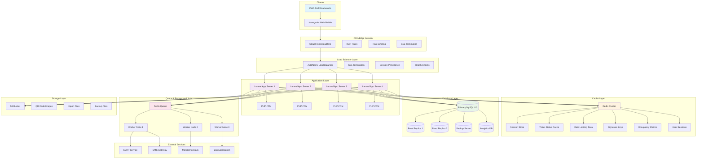

### Arquitectura de Despliegue - Desarrollo

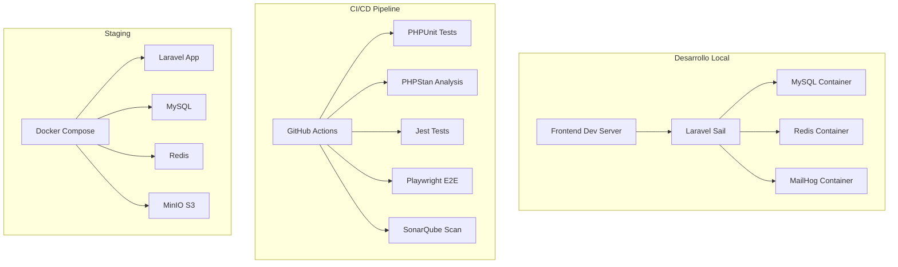

## Escenarios (Scenarios View)

### Escenario 1: Validación QR Exitosa

**Contexto**: Staff escanea QR válido en puerta de auditorio
**Calidad**: Rendimiento crítico, seguridad alta

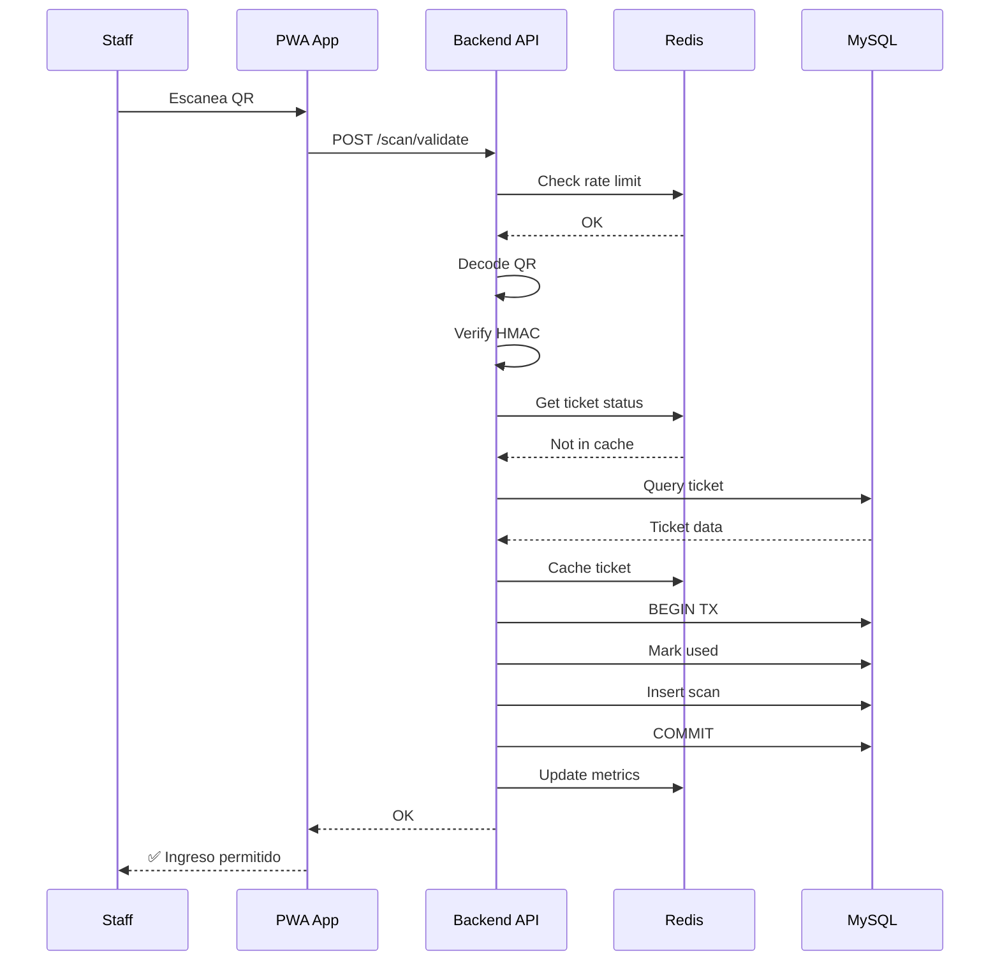

**Requisitos de Calidad**:
- Latencia <150ms p95
- Disponibilidad 99.9%
- Seguridad: Firma HMAC validada

### Escenario 2: Ingreso Masivo

**Contexto**: 500 personas llegan simultáneamente al evento
**Calidad**: Escalabilidad, consistencia

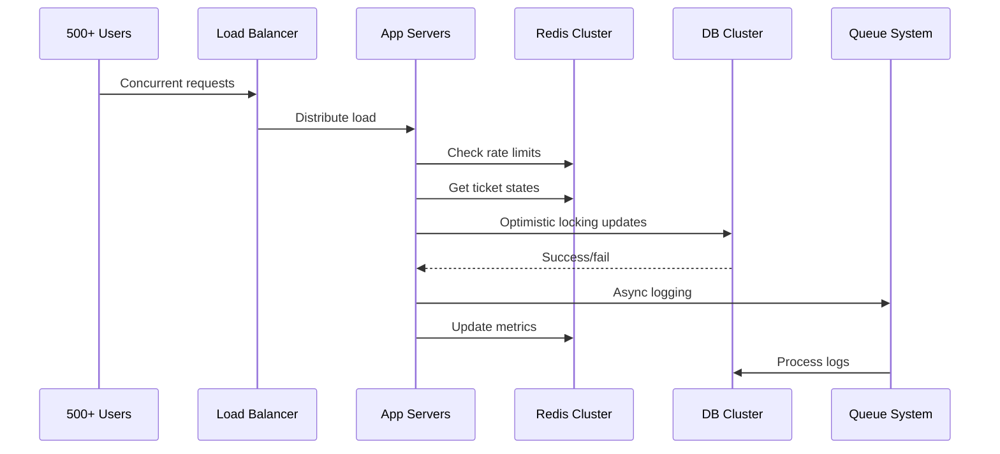

**Requisitos de Calidad**:
- Throughput: 200 req/s sostenido
- Latencia: <150ms p95 bajo carga
- Consistencia: Transacciones ACID

### Escenario 3: Conectividad Intermitente

**Contexto**: Staff pierde conexión durante evento
**Calidad**: Resiliencia, consistencia eventual

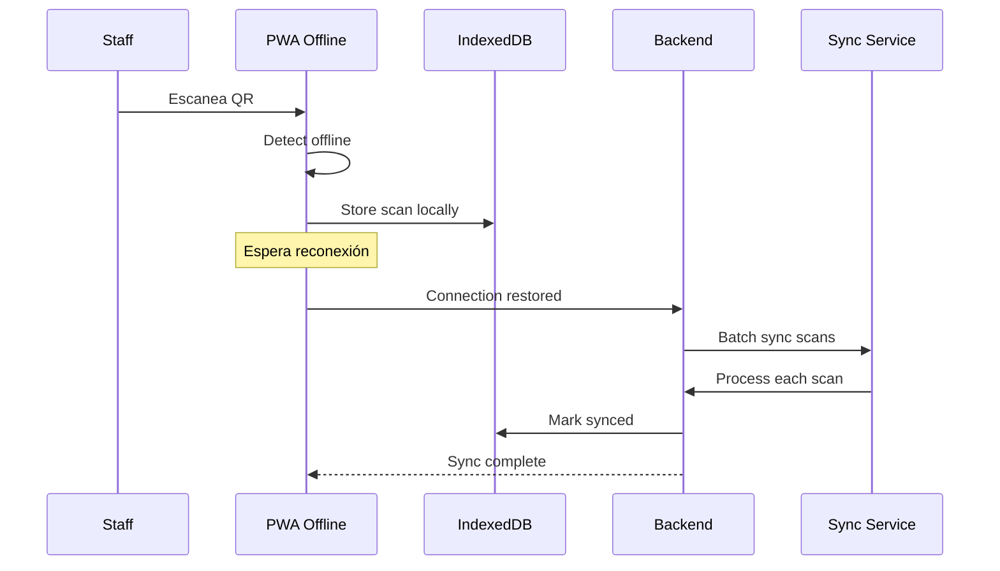

**Requisitos de Calidad**:
- 0% pérdida de datos
- Sincronización automática
- Consistencia eventual

### Escenario 4: Ataque de Falsificación

**Contexto**: Intento de usar QR alterado
**Calidad**: Seguridad, detección de fraudes

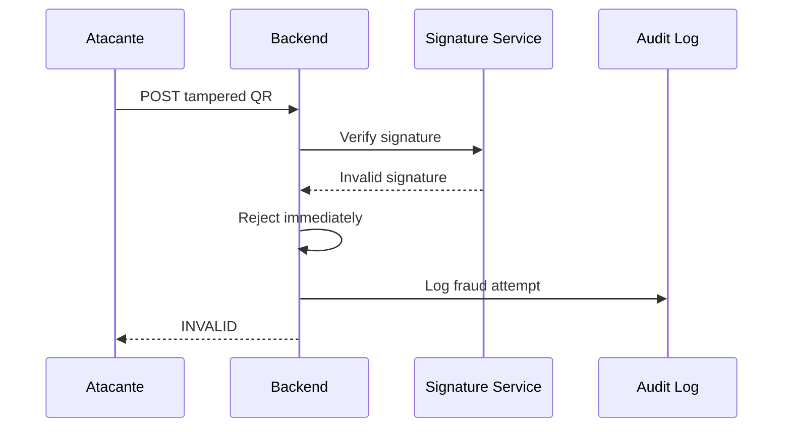

**Requisitos de Calidad**:
- Detección 100% de firmas inválidas
- Auditoría completa
- No impacto en rendimiento legítimo

## Vista de Procesos - Hilos y Comunicación

### Arquitectura de Hilos

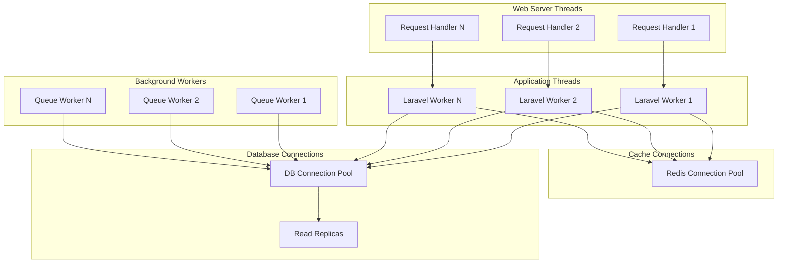

### Comunicación Entre Componentes

- **Síncrona**: HTTP REST API entre frontend y backend
- **Asíncrona**: Redis Queue para emails, logs, notificaciones
- **Cache**: Redis para estados de tickets, sesiones, métricas
- **Base de Datos**: MySQL con read replicas para consultas
- **Eventos**: Laravel Events para acoplamiento loose entre módulos

## Métricas Arquitecturales

| Vista | Métrica | Umbral | Herramienta |
|-------|---------|--------|------------|
| Lógica | Acoplamiento eferente | <0.8 | PHPDepend |
| Lógica | Cohesión LCOM | <1.5 | PHPDepend |
| Desarrollo | Cobertura pruebas | >85% | PHPUnit |
| Desarrollo | Complejidad ciclomática | <10 | PHPStan |
| Procesos | Latencia p95 | <150ms | k6/Prometheus |
| Procesos | Throughput | >200 req/s | k6 |
| Física | Disponibilidad | >99.9% | Pingdom |
| Física | Uso CPU/memoria | <80% | Grafana |
| Escenarios | Tasa éxito validaciones | >99.9% | Custom metrics |