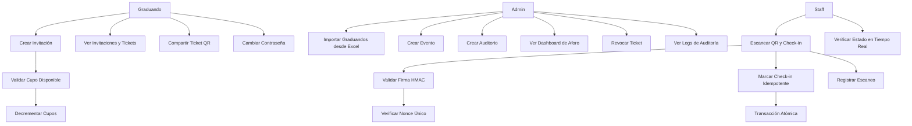

# Casos de Uso 2.0 - Sistema Anti-Falsificación de Entradas

## Diagrama General de Casos de Uso

## Casos de Uso Detallados

### CU-01: Importar Graduandos desde Excel (Admin)

**Actores**: Admin
**Precondiciones**:
- Usuario autenticado con rol ADMIN
- Archivo Excel válido con formato correcto

**Flujo Principal**:
1. Admin selecciona archivo Excel
2. Sistema valida formato y tamaño (<10MB)
3. Sistema procesa filas: user_id, cupos_permitidos
4. Para cada fila válida:
   - Crea registro en graduates
   - Genera contraseña temporal
   - Envía email con credenciales
5. Sistema reporta resultados: importados, errores

**Flujos Alternativos**:
- **FA1**: Archivo inválido → Mensaje error, sin procesamiento
- **FA2**: user_id no existe → Fila marcada como error
- **FA3**: Email falla → Log error, continúa con siguiente

**Postcondiciones**:
- Graduandos creados con cupos asignados
- Emails enviados (o errores logged)
- Reporte de importación generado

**Reglas de Negocio**:
- user_id debe existir en users
- cupos_permitidos ≥ 0
- Contraseña expira en 24h
- Procesamiento transaccional por lotes

### CU-02: Autenticación Primer Login (Graduando)

**Actores**: Graduando
**Precondiciones**:
- Usuario importado con contraseña temporal
- Contraseña no expirada

**Flujo Principal**:
1. Graduando ingresa email y contraseña temporal
2. Sistema valida credenciales
3. Sistema detecta primer login
4. Sistema requiere cambio de contraseña
5. Graduando ingresa nueva contraseña
6. Sistema actualiza password y marca first_login=false
7. Sistema redirige a dashboard

**Flujos Alternativos**:
- **FA1**: Contraseña expirada → Mensaje error, contactar admin
- **FA2**: Contraseña inválida → Reintento limitado

**Postcondiciones**:
- Usuario autenticado
- Contraseña actualizada
- Log de acceso creado

### CU-03: Crear Invitación (Graduando)

**Actores**: Graduando
**Precondiciones**:
- Usuario autenticado con rol GRADUANDO
- Cupos disponibles > 0

**Flujo Principal**:
1. Graduando selecciona evento activo
2. Sistema valida cupos disponibles
3. Sistema crea invitación con estado CREATED
4. Sistema genera ticket con QR firmado
5. Sistema decrementa cupos usados
6. Sistema muestra QR generado

**Flujos Alternativos**:
- **FA1**: Sin cupos → Mensaje error
- **FA2**: Evento no activo → Lista eventos alternativos
- **FA3**: Error generación QR → Retry automático

**Postcondiciones**:
- Invitación creada
- Ticket generado con firma HMAC
- Cupos actualizados
- QR disponible para compartir

**Reglas de Negocio**:
- Máximo 1 invitación por evento por graduando
- Cupos validados antes de crear
- QR incluye: eventId, ticketId, nonce, issuedAt

### CU-04: Escanear QR y Check-in (Staff/Admin)

**Actores**: Staff, Admin
**Precondiciones**:
- Usuario autenticado con rol STAFF o ADMIN
- Dispositivo autorizado
- QR válido generado por sistema

**Flujo Principal**:
1. Staff escanea QR con app móvil
2. Sistema decodifica QR base64
3. Sistema extrae payload + signature
4. Sistema verifica firma HMAC-SHA256
5. Sistema busca ticket por nonce
6. Sistema valida estado (no usado, no revocado, no expirado)
7. Sistema inicia transacción
8. Sistema marca ticket como usado (used_at = now)
9. Sistema crea registro en scans
10. Sistema confirma check-in exitoso

**Flujos Alternativos**:
- **FA1**: Firma inválida → Rechazo inmediato "INVALID"
- **FA2**: Ticket ya usado → Rechazo "DUPLICATE"
- **FA3**: Ticket revocado → Rechazo "REVOKED"
- **FA4**: Ticket expirado → Rechazo "EXPIRED"
- **FA5**: Rate limit excedido → Rechazo temporal

**Flujos de Excepción**:
- **FE1**: Error DB → Rollback, retry automático
- **FE2**: Concurrencia → Optimistic locking, retry

**Postcondiciones**:
- Ticket marcado como usado
- Registro de scan creado
- Ocupación auditorio actualizada
- Log de auditoría generado

**Reglas de Negocio**:
- Ticket único uso
- Validación idempotente
- Transacción atómica
- Rate limiting por dispositivo
- Nonce único previene replay

### CU-05: Ver Dashboard de Aforo (Admin)

**Actores**: Admin
**Precondiciones**:
- Usuario autenticado con rol ADMIN

**Flujo Principal**:
1. Admin accede a dashboard
2. Sistema consulta eventos activos
3. Para cada evento:
   - Obtiene auditorios
   - Calcula ocupación actual
   - Computa métricas en tiempo real
4. Sistema muestra métricas consolidadas
5. Sistema actualiza datos cada 30s

**Flujos Alternativos**:
- **FA1**: Sin eventos activos → Mensaje informativo
- **FA2**: Datos no disponibles → Cache fallback

**Postcondiciones**:
- Métricas actualizadas mostradas
- Alertas configuradas (ocupación >90%)

**Reglas de Negocio**:
- Ocupación = tickets usados / capacidad
- Actualización automática cada 30s
- Filtros por evento/auditorio

### CU-06: Revocar Ticket (Admin)

**Actores**: Admin
**Precondiciones**:
- Usuario autenticado con rol ADMIN
- Ticket existe y no está usado

**Flujo Principal**:
1. Admin busca ticket por ID
2. Sistema valida estado (no usado)
3. Sistema marca como revocado (revoked_at = now)
4. Sistema notifica graduando (opcional)
5. Sistema registra en audit log

**Flujos Alternativos**:
- **FA1**: Ticket ya usado → Error "no se puede revocar"
- **FA2**: Ticket ya revocado → Mensaje informativo

**Postcondiciones**:
- Ticket marcado como revocado
- Log de auditoría creado

### CU-07: Ver Logs de Auditoría (Admin)

**Actores**: Admin
**Precondiciones**:
- Usuario autenticado con rol ADMIN

**Flujo Principal**:
1. Admin filtra logs por criterios
2. Sistema consulta audit_logs
3. Sistema muestra resultados paginados
4. Admin puede exportar a CSV

**Flujos Alternativos**:
- **FA1**: Sin resultados → Mensaje vacío
- **FA2**: Filtros inválidos → Reset a defaults

**Postcondiciones**:
- Logs mostrados con paginación
- Export disponible si solicitado

## Escenarios de Calidad

### Escenario: Ingreso Masivo 10:00 AM
**Contexto**: 500 personas intentando ingresar simultáneamente
**Actores**: Múltiples Staff, sistema
**Flujo**:
1. Escaneos concurrentes llegan al API
2. Rate limiting controla flujo (10/min por dispositivo)
3. Cache Redis maneja estados de tickets
4. Transacciones optimistas evitan deadlocks
5. Queue procesa logs asíncronamente
6. Dashboard actualiza métricas en tiempo real

**Criterios de Éxito**:
- <150ms p95 latencia
- 0% fallos de validación
- Métricas actualizadas <5s

### Escenario: Conectividad Intermitente
**Contexto**: Staff en puerta con conexión inestable
**Actores**: Staff, sistema PWA
**Flujo**:
1. PWA detecta desconexión
2. Escaneos se almacenan localmente
3. Reintentos automáticos al recuperar conexión
4. Sincronización batch con servidor
5. Conflictos resueltos por timestamp

**Criterios de Éxito**:
- 0% pérdida de escaneos
- Sincronización <30s al reconectar
- Estado consistente

## Requisitos No Funcionales por Caso de Uso

| Caso de Uso | Rendimiento | Disponibilidad | Seguridad |
|-------------|-------------|----------------|-----------|
| CU-01 | <30s para 1000 registros | 99.9% | Validación input |
| CU-04 | <150ms p95 | 99.9% | Firma HMAC, rate limiting |
| CU-05 | <2s carga inicial | 99.9% | RBAC |
| Todos | <500ms p95 | 99.9% | Auditoría completa |