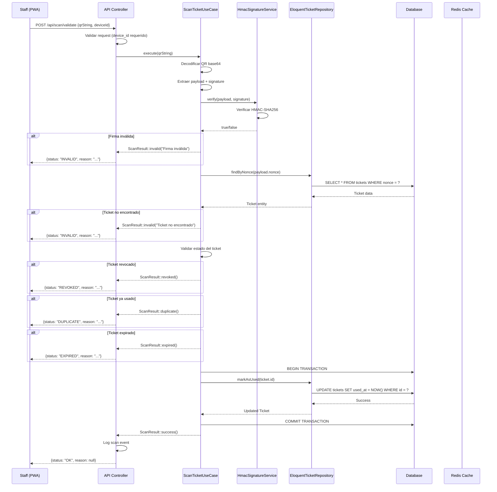

# Diagramas UML - Arquitectura Clean Architecture

## Diagrama de Clases

```mermaid
classDiagram
    %% Entidades (Entities)
    class Ticket {
        +int id
        +int invitationId
        +array qrPayload
        +string qrSignature
        +string nonce
        +Carbon issuedAt
        +Carbon? usedAt
        +Carbon? revokedAt
        +isUsed(): bool
        +isRevoked(): bool
        +isExpired(): bool
        +canBeUsed(): bool
    }

    class Invitation {
        +int id
        +int graduateId
        +int eventId
        +string status
        +Carbon createdAt
        +isCreated(): bool
        +isSent(): bool
        +isRevoked(): bool
    }

    class Graduate {
        +int id
        +int userId
        +int cuposPermitidos
        +int cuposUsados
        +hasAvailableSlots(): bool
        +getRemainingSlots(): int
        +canCreateInvitation(): bool
    }

    class Event {
        +int id
        +string name
        +Carbon date
        +string status
        +isActive(): bool
        +isUpcoming(): bool
        +isPast(): bool
    }

    class Auditorium {
        +int id
        +int eventId
        +string name
        +int capacity
        +int currentOccupancy
        +hasAvailableCapacity(): bool
        +getAvailableCapacity(): int
        +canAccommodate(int): bool
    }

    %% Casos de Uso (Use Cases)
    class CreateInvitationUseCase {
        -GraduateRepositoryInterface graduateRepository
        -InvitationRepositoryInterface invitationRepository
        -EventRepositoryInterface eventRepository
        -TicketRepositoryInterface ticketRepository
        -SignatureServiceInterface signatureService
        -QrGeneratorInterface qrGenerator
        +execute(int, int): Invitation
    }

    class ImportGraduatesUseCase {
        -GraduateRepositoryInterface graduateRepository
        +execute(Collection): array
    }

    class ScanTicketUseCase {
        -TicketRepositoryInterface ticketRepository
        -SignatureServiceInterface signatureService
        +execute(string): ScanResult
    }

    %% Interfaces (Ports)
    class TicketRepositoryInterface {
        <<interface>>
        +findById(int): Ticket?
        +findByNonce(string): Ticket?
        +save(Ticket): Ticket
        +markAsUsed(int): Ticket?
        +revoke(int): bool
        +getByInvitationId(int): array
    }

    class GraduateRepositoryInterface {
        <<interface>>
        +findById(int): Graduate?
        +findByUserId(int): Graduate?
        +save(Graduate): Graduate
        +incrementUsedSlots(int): Graduate?
        +getAll(): array
    }

    class InvitationRepositoryInterface {
        <<interface>>
        +findById(int): Invitation?
        +save(Invitation): Invitation
        +findByGraduateId(int): array
        +findByEventId(int): array
        +updateStatus(int, string): bool
    }

    class EventRepositoryInterface {
        <<interface>>
        +findById(int): Event?
        +save(Event): Event
        +getActiveEvents(): array
        +getUpcomingEvents(): array
        +updateStatus(int, string): bool
    }

    class AuditoriumRepositoryInterface {
        <<interface>>
        +findById(int): Auditorium?
        +findByEventId(int): array
        +save(Auditorium): Auditorium
        +updateOccupancy(int, int): bool
        +incrementOccupancy(int): bool
    }

    class SignatureServiceInterface {
        <<interface>>
        +sign(array): string
        +verify(array, string): bool
        +rotateKey(): void
    }

    class MailServiceInterface {
        <<interface>>
        +sendInvitationEmail(string, array): bool
        +sendTicketEmail(string, array): bool
    }

    class QrGeneratorInterface {
        <<interface>>
        +generate(string): string
        +generateWithLogo(string, string?): string
    }

    %% Adaptadores (Adapters)
    class EloquentTicketRepository {
        +findById(int): Ticket?
        +findByNonce(string): Ticket?
        +save(Ticket): Ticket
        +markAsUsed(int): Ticket?
        +revoke(int): bool
        +getByInvitationId(int): array
    }

    class EloquentGraduateRepository {
        +findById(int): Graduate?
        +findByUserId(int): Graduate?
        +save(Graduate): Graduate
        +incrementUsedSlots(int): Graduate?
        +getAll(): array
    }

    class EloquentInvitationRepository {
        +findById(int): Invitation?
        +save(Invitation): Invitation
        +findByGraduateId(int): array
        +findByEventId(int): array
        +updateStatus(int, string): bool
    }

    class EloquentEventRepository {
        +findById(int): Event?
        +save(Event): Event
        +getActiveEvents(): array
        +getUpcomingEvents(): array
        +updateStatus(int, string): bool
    }

    class EloquentAuditoriumRepository {
        +findById(int): Auditorium?
        +findByEventId(int): array
        +save(Auditorium): Auditorium
        +updateOccupancy(int, int): bool
        +incrementOccupancy(int): bool
    }

    class HmacSignatureService {
        +sign(array): string
        +verify(array, string): bool
        +rotateKey(): void
    }

    class LaravelMailService {
        +sendInvitationEmail(string, array): bool
        +sendTicketEmail(string, array): bool
    }

    class QrCodeGenerator {
        +generate(string): string
        +generateWithLogo(string, string?): string
    }

    %% Relaciones
    Ticket --> Invitation
    Invitation --> Graduate
    Invitation --> Event
    Event --> Auditorium

    CreateInvitationUseCase --> GraduateRepositoryInterface
    CreateInvitationUseCase --> InvitationRepositoryInterface
    CreateInvitationUseCase --> EventRepositoryInterface
    CreateInvitationUseCase --> TicketRepositoryInterface
    CreateInvitationUseCase --> SignatureServiceInterface
    CreateInvitationUseCase --> QrGeneratorInterface

    ImportGraduatesUseCase --> GraduateRepositoryInterface
    ScanTicketUseCase --> TicketRepositoryInterface
    ScanTicketUseCase --> SignatureServiceInterface

    EloquentTicketRepository ..|> TicketRepositoryInterface
    EloquentGraduateRepository ..|> GraduateRepositoryInterface
    EloquentInvitationRepository ..|> InvitationRepositoryInterface
    EloquentEventRepository ..|> EventRepositoryInterface
    EloquentAuditoriumRepository ..|> AuditoriumRepositoryInterface
    HmacSignatureService ..|> SignatureServiceInterface
    LaravelMailService ..|> MailServiceInterface
    QrCodeGenerator ..|> QrGeneratorInterface
```



## Diagrama de Secuencia - Escaneo de QR



## Diagrama de Despliegue

```mermaid
graph TB
    subgraph "Cliente"
        A[PWA Staff/Graduando]
        B[Navegador Web]
    end

    subgraph "CDN/Edge"
        C[CloudFront/Cloudflare]
    end

    subgraph "Load Balancer"
        D[ALB/Nginx]
    end

    subgraph "App Servers"
        E1[Laravel App Server 1]
        E2[Laravel App Server 2]
        E3[Laravel App Server 3]
    end

    subgraph "Cache Layer"
        F[Redis Cluster]
        F1[Session Store]
        F2[Signature Keys]
        F3[Rate Limiting]
        F4[Cache de Tickets]
    end

    subgraph "Database Layer"
        G[(Primary MySQL)]
        H[(Read Replica)]
        I[(Backup)]
    end

    subgraph "Queue System"
        J[Redis Queue]
        K[Worker Nodes]
    end

    subgraph "External Services"
        L[SMTP Service]
        M[SMS Gateway]
        N[Monitoring]
    end

    subgraph "Storage"
        O[S3 Bucket]
        P[CDN Images]
    end

    A --> B
    B --> C
    C --> D
    D --> E1
    D --> E2
    D --> E3

    E1 --> F
    E2 --> F
    E3 --> F

    F --> F1
    F --> F2
    F --> F3
    F --> F4

    E1 --> G
    E2 --> G
    E3 --> G
    G --> H
    G --> I

    E1 --> J
    E2 --> J
    E3 --> J
    J --> K

    K --> L
    K --> M
    K --> N

    E1 --> O
    E2 --> O
    E3 --> O
    O --> P

    style A fill:#e1f5fe
    style E1 fill:#f3e5f5
    style E2 fill:#f3e5f5
    style E3 fill:#f3e5f5
    style G fill:#e8f5e8
    style F fill:#fff3e0