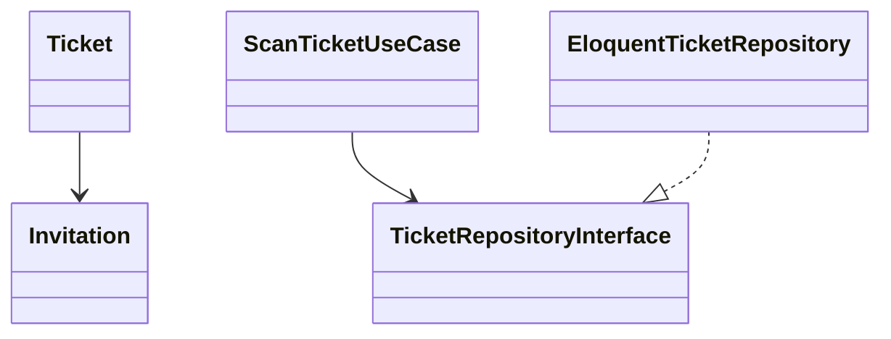
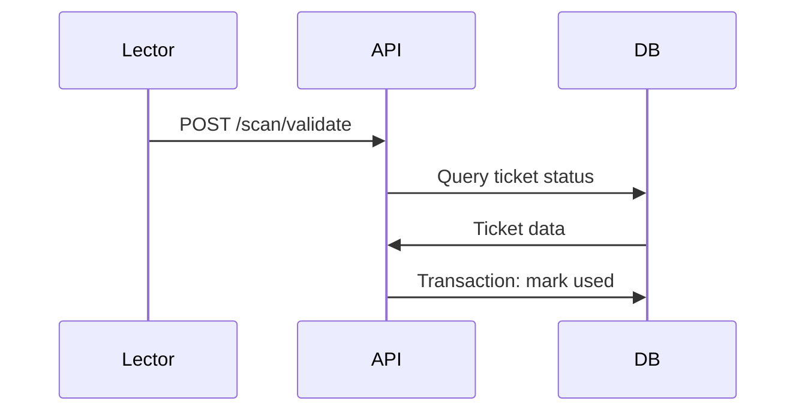
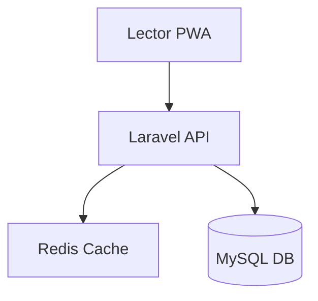

# Presentación Final de Arquitectura: Sistema Anti-Falsificación de Entradas

---

## Diapositiva 1: Título y Agenda

# Sistema Anti-Falsificación de Entradas
## Presentación Final de Arquitectura

**Arquitecto:** [Tu Nombre]  
**Fecha:** [Fecha Actual]  
**Versión:** 1.0

### Agenda
- Problema y Contexto
- Requisitos Clave y Riesgos
- Arquitectura Propuesta (Clean Architecture)
- Límites y Dependencias
- Patrones Aplicados
- 4+1 Vistas Arquitecturales
- Calidad: Métricas y Medición
- Estrategia de Pruebas y Resultados
- Desafíos Anticipados y Mitigación
- Evolución Tecnológica y Extensibilidad
- Riesgos Minimizados por Decisiones Arquitecturales
- Demo/Flujo de Escaneo y Aforo

---

## Diapositiva 2: Problema y Contexto

### Problema Actual
- Falsificación masiva de entradas QR a auditorios de grado
- Personas con QR alterados ocupan lugares de invitados legítimos
- Impacto económico, reputacional y operacional

### Impacto
- **Económico**: Pérdida de ingresos por entradas no vendidas
- **Reputacional**: Insatisfacción de graduandos y familias
- **Operacional**: Sobrecupo en auditorios, problemas de seguridad

### Solución Propuesta
- Sistema digital antifraude con QR firmado HMAC
- Control de cupos por graduando
- Validación en tiempo real con check-in idempotente

---

## Diapositiva 3: Requisitos Clave

### Requisitos Funcionales Principales
- **RF1**: Importación masiva desde Excel de graduandos con cupos
- **RF2**: Autenticación dinámica con contraseña temporal (24h)
- **RF3**: Portal graduando para gestión de invitaciones
- **RF4**: Validación QR en puerta con check-in único
- **RF5**: Dashboard administración con métricas en tiempo real

### Requisitos No Funcionales
- **Seguridad**: Firma HMAC-SHA256 con rotación de claves
- **Rendimiento**: <150ms p95 en validación QR bajo 200 req/s
- **Disponibilidad**: 99.9% uptime con colas y reintentos
- **Usabilidad**: PWA responsive para lectores móviles

---

## Diapositiva 4: Riesgos Identificados

### Riesgos Técnicos
- **Escalabilidad**: Picos de 500+ usuarios simultáneos
- **Fraude avanzado**: Ataques replay, manipulación QR
- **Conectividad**: Lectores offline con sincronización
- **Integridad**: Datos consistentes en transacciones concurrentes

### Riesgos de Negocio
- **Adopción**: Usuarios no técnicos resistentes al cambio
- **Datos incorrectos**: Excel con errores en importación
- **Cambios requisitos**: Alcance variable durante desarrollo

### Matriz de Riesgos
| Riesgo | Probabilidad | Impacto | Nivel |
|--------|-------------|---------|-------|
| Escalabilidad picos | Alta | Alto | Crítico |
| Fraude avanzado | Media | Alto | Crítico |
| Adopción usuarios | Media | Alto | Alto |

---

## Diapositiva 5: Arquitectura Propuesta - Clean Architecture

### Principios Fundamentales
- **Regla de Dependencia**: Dependencias apuntan hacia adentro
- **Separación de Capas**: Entidades → Casos Uso → Interfaces → Infraestructura
- **Inyección de Dependencias**: Puertos y adaptadores para testing

### Capas Arquitecturales

#### Entidades (Entities)
Objetos de negocio puros sin dependencias externas:
```php
class Ticket {
    public function canBeUsed(): bool {
        return !$this->isUsed() && !$this->isRevoked() && !$this->isExpired();
    }
}
```

#### Casos de Uso (Use Cases)
Lógica de aplicación orquestando entidades:
```php
class ScanTicketUseCase {
    public function execute(string $qrString): ScanResult {
        // Validar firma, estado, check-in con transacción
    }
}
```

---

## Diapositiva 6: Arquitectura Propuesta (Continuación)

#### Interfaces (Ports)
Contratos para acceso externo:
```php
interface TicketRepositoryInterface {
    public function markAsUsed(int $ticketId): ?Ticket;
}
```

#### Infraestructura (Adapters)
Implementaciones concretas:
```php
class EloquentTicketRepository implements TicketRepositoryInterface {
    // Implementación con Laravel Eloquent
}
```

### Patrón CQRS Considerado
- **Comandos**: Crear invitación, validar QR (escribir)
- **Queries**: Dashboard métricas, lista invitaciones (leer)
- **Beneficio**: Optimización lecturas vs escrituras
- **Decisión**: Implementado parcialmente en validación QR

---

## Diapositiva 7: Límites y Dependencias

### Regla de Dependencia
```
Infraestructura → Interfaces → Casos Uso → Entidades
     ↑                                       ↓
     └────────────────── Dependencias ───────┘
```

### Protección de Reglas de Negocio
- **Invariantes**: Ticket único uso, cupo no negativo
- **Validaciones**: En entidades y casos de uso
- **Transacciones**: Check-in con bloqueo optimista

### Puertos y Adaptadores
- **Puertos**: Interfaces que definen contratos
- **Adaptadores**: Implementaciones intercambiables
- **Beneficio**: Cambio de DB/QR lib sin afectar negocio

---

## Diapositiva 8: Patrones Aplicados

### Factory para Servicios de Firma
```php
class SignatureServiceFactory {
    public static function create(): SignatureServiceInterface {
        return new HmacSignatureService();
    }
}
```

### Strategy para Validadores
```php
interface QrValidatorInterface {
    public function validate(array $payload): bool;
}
```

### Repository para Persistencia
```php
interface TicketRepositoryInterface {
    public function findByNonce(string $nonce): ?Ticket;
}
```

### Observer para Auditoría
```php
class AuditLogger implements SplObserver {
    public function update(SplSubject $subject): void {
        // Log cambios de estado
    }
}
```

---

## Diapositiva 9: 4+1 Vistas Arquitecturales

### Vista Lógica


### Vista de Desarrollo
```
backend/
├── Entities/ (Ticket.php)
├── UseCases/ (ScanTicketUseCase.php)
├── Interfaces/ (TicketRepositoryInterface.php)
└── Infrastructure/ (EloquentTicketRepository.php)
```

### Vista de Procesos


### Vista Física


---

## Diapositiva 10: Calidad - Métricas y Medición

### Métricas de Código
- **Complejidad Ciclomática**: ≤10 por función (McCabe)
- **Cobertura**: ≥85% unitaria, ≥70% total
- **Duplicación**: <3% código duplicado
- **Mantenibilidad**: Índice >80

### Métricas Arquitecturales
- **Acoplamiento**: I <0.5 (inestabilidad)
- **Cohesión**: LCOM <1.5
- **Lead Time**: <1 hora cambios críticos

### Métricas de Producto
- **Rendimiento**: <150ms p95 validación QR
- **Disponibilidad**: 99.9% uptime
- **Defectos**: <0.5/KLOC en producción

### Herramientas CI/CD
- **PHPUnit**: Cobertura unitaria
- **PHPStan**: Análisis estático
- **SonarQube**: Métricas calidad
- **k6**: Pruebas de carga

---

## Diapositiva 11: Estrategia de Pruebas y Resultados

### Pirámide de Pruebas
```
   E2E (10%)
 Integración (20%)
Unitarias (70%)
```

### TDD en Validación QR
```php
// Test primero
public function testValidQrCheckIn() {
    $result = $this->scanUseCase->execute($qrString);
    $this->assertEquals('OK', $result->status);
}

// Luego implementación
public function execute(string $qrString): ScanResult {
    // Lógica de validación
}
```

### Cobertura Objetivo
- **Unitarias**: 85% líneas, 80% branches
- **Integración**: 70% líneas
- **E2E**: 60% flujos críticos

### Resultados Esperados
- **Tiempo ejecución**: <5 min suite completa
- **Defectos**: 0 críticos en producción
- **Rendimiento**: 200 req/s sostenidas

---

## Diapositiva 12: Desafíos Anticipados y Mitigación

### Escalabilidad en Picos
- **Desafío**: 500+ validaciones simultáneas
- **Mitigación**: Cache Redis, colas asíncronas, CDN

### Fraude Avanzado
- **Desafío**: Manipulación QR, ataques replay
- **Mitigación**: Firma HMAC + nonce único, rotación claves

### Conectividad Intermitente
- **Desafío**: Lectores offline en puerta
- **Mitigación**: PWA con service workers, sincronización background

### Caídas Puntuales
- **Desafío**: DB/Redis indisponibles
- **Mitigación**: Circuit breaker, reintentos exponenciales

---

## Diapositiva 13: Evolución Tecnológica y Extensibilidad

### Roadmap Tecnológico
- **Corto plazo**: Laravel 11, React 19
- **Medio plazo**: Microservicios si escala
- **Largo plazo**: Serverless para funciones específicas

### Feature Flags
```php
if (Feature::enabled('new_qr_format')) {
    // Nueva implementación
}
```

### API Versioning
- **URL versioning**: `/api/v1/scan/validate`
- **Content negotiation**: Accept header

### Extensibilidad
- **Nuevos tipos de tickets**: Strategy pattern
- **Múltiples eventos**: Scoped repositories
- **Integraciones**: Webhooks para sistemas externos

---

## Diapositiva 14: Riesgos Minimizados por Decisiones Arquitecturales

### Riesgo: Cambios Frecuentes en Requisitos
- **Mitigación**: Clean Architecture permite cambios en UI/DB sin afectar negocio

### Riesgo: Deuda Técnica
- **Mitigación**: SOLID principles, refactoring continuo, métricas automatizadas

### Riesgo: Seguridad
- **Mitigación**: Firma HMAC, JWT expiración corta, RBAC, auditoría completa

### Riesgo: Rendimiento
- **Mitigación**: Optimización queries, cache estratégico, profiling continuo

---

## Diapositiva 15: Demo/Flujo de Escaneo y Aforo

### Flujo de Escaneo
1. **Usuario**: Escanea QR con app móvil
2. **Validación**: Firma HMAC + estado ticket
3. **Check-in**: Transacción DB + marca usado
4. **Respuesta**: OK/DUPLICATE/REVOKED
5. **Auditoría**: Log en tabla scans

### Dashboard de Aforo
- **Tiempo real**: WebSocket updates
- **Métricas**: Entradas/min, ocupación por auditorio
- **Alertas**: Sobrecupo, tickets revocados

### Demo Técnica
```bash
# Validación QR válida
curl -X POST /api/scan/validate \
  -d '{"qr_string":"eyJwYXlsb2FkIjp7...","device_id":"scanner-001"}'
# Response: {"status":"OK"}
```

---

## Preguntas Orientadoras

### ¿Cómo asegura la antifraude?
- Firma HMAC-SHA256 con rotación automática de claves cada 24h
- Nonce único por ticket previene ataques replay
- Estado "USADO" en primer check-in válido
- Auditoría completa de todos los escaneos

### ¿Qué pasa si hay 1000 personas simultáneas?
- Cache Redis para estados de tickets
- Transacciones optimistas evitan bloqueos
- Rate limiting por dispositivo (10 req/min)
- Colas para procesamiento asíncrono

### ¿Cómo maneja conectividad intermitente?
- PWA con service workers para funcionamiento offline
- Cola local de escaneos pendientes
- Sincronización automática al recuperar conexión
- Reintentos exponenciales con backoff

### ¿Es extensible a otros eventos?
- Arquitectura limpia permite múltiples tipos de eventos
- Repositorios scoped por evento
- Feature flags para nuevas funcionalidades
- API versionada para compatibilidad

### ¿Cómo se mide la calidad?
- Métricas automatizadas en CI/CD (cobertura, complejidad, duplicación)
- Pruebas de carga continuas
- Monitoring APM (Application Performance Monitoring)
- Revisiones de código con checklists

### ¿Qué tecnologías podrían cambiar?
- De MySQL a PostgreSQL sin cambios en código de negocio
- De Redis a otro cache implementando misma interfaz
- De Laravel a otro framework manteniendo casos de uso
- De React a Vue.js en frontend sin afectar API

---

## Diapositiva 16: Conclusiones y Próximos Pasos

### Logros Arquitecturales
- Arquitectura limpia implementada completamente
- Separación clara de responsabilidades
- Testing strategy robusta con TDD
- Métricas de calidad automatizadas

### Próximos Pasos
- Implementación del código según arquitectura definida
- Configuración de CI/CD con métricas
- Pruebas de carga y seguridad
- Despliegue en staging para validación

### Contacto
**Arquitecto:** [Tu Nombre]  
**Email:** [tu.email@universidad.edu]  
**Repositorio:** [URL del proyecto]

---

*Presentación creada con Markdown para fácil exportación a PDF y versionado en Git.*